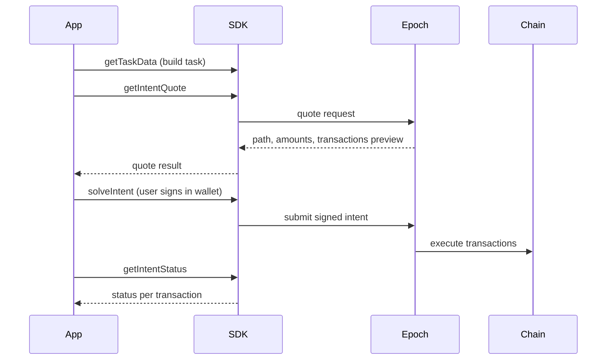

# Core Concepts

## Glossary

| Term                     | Definition                                                                                                          |
| ------------------------ | ------------------------------------------------------------------------------------------------------------------- |
| **Intent**               | A signed request describing what the user wants executed across one or more chains.                                 |
| **Task**                 | The structured payload inside an intent: tokens, amounts, destination chain, task type, and optional protocol data. |
| **Path**                 | The route Epoch selects to fulfill an intent (e.g. swap on source chain → bridge → protocol call on destination).   |
| **Nonce**                | A unique number assigned per intent; prevents replay and ties signatures to a specific request.                     |
| **Approval**             | ERC-20 allowance the user grants so Epoch can move input tokens on a given chain.                                   |
| **Constraint**           | Optional bounds on execution (deadline, preferred solvers, optimization factor).                                    |
| **Quote**                | A preview of the execution path, input/output amounts, and whether a resource lock is required.                     |
| **Execution**            | The on-chain transactions Epoch submits after the user signs.                                                       |
| **Sender**               | The user's connected wallet address (EOA).                                                                          |
| **Protocol interaction** | A task type where Epoch executes a protocol-specific action (e.g. `buyTicket`) on the destination chain.            |
| **`extraData`**          | JSON fields describing the protocol and action for protocol-interaction tasks.                                      |
| **Resource lock**        | Collateral locked via The Compact when server-coordinated execution is required.                                    |

***

## Intent lifecycle



### Typical flow

1. **Build task** — Use `getTaskData` with token addresses, amounts, destination chain, and task type.
2. **Get quote** — Call `getIntentQuote` to show the user expected input/output and path.
3. **Solve** — Call `solveIntent`; the user signs approvals and intent transactions in their wallet.
4. **Poll status** — Call `getIntentStatus` until all transactions complete.

### Quote first vs solve directly

| Approach             | When to use                                                                       |
| -------------------- | --------------------------------------------------------------------------------- |
| **Quote then solve** | User must review amounts before signing (recommended for fixed-output purchases). |
| **Solve directly**   | User already knows the input; quote is fetched internally by the SDK.             |

***

## Task types

The SDK uses these task types (from `@epoch-protocol/epoch-commons-sdk` or the SDK's own `TaskType` enum):

| Task type               | Value                  | Use case                                                                    |
| ----------------------- | ---------------------- | --------------------------------------------------------------------------- |
| **GetTokenOut**         | `gettokenout`          | Swap or bridge to receive a target token on a destination chain             |
| **Deposit**             | `deposit`              | Deposit into a Compact-backed flow                                          |
| **ProtocolInteraction** | `protocol-interaction` | Execute a protocol action (e.g. buy raffle ticket) on the destination chain |

Each task type maps to a 4-byte identifier derived from `keccak256(taskTypeString)[0:4]`.

***

## Authentication and signing

### User wallet

* Users connect a **standard EOA wallet** (MetaMask, Rainbow, WalletConnect, etc.).
* The SDK accepts a viem `walletClient` for signing.
* **`sender`** / **`sponsorAddress`** in requests is the user's wallet address.
* No smart-wallet deployment, Epoch Module, or ERC-7579 setup is required for users.

### Intent signature

* The user signs intent data with their wallet as part of the `solveIntent` flow.
* The SDK handles nonce retrieval and signature construction internally when using the high-level SDK methods.

### SDK configuration

* Integrators use the **`@epoch-protocol/epoch-intents-sdk`** with an `apiBaseUrl` pointing at the Epoch allocator service.
* Testnet: `https://testnet-dev.epochprotocol.xyz`
* Mainnet: `https://api.epochprotocol.xyz`
* Contact Epoch for production onboarding and protocol partner setup.

***

## Protocol interaction and `extraData`

For protocol-interaction tasks, you pass additional fields describing **which protocol** and **which action** to execute:

```typescript
extraDataTypestring: "bytes32 protocol,bytes32 action,address raffleAddress,uint256 numberOfTickets"
extraData: {
  protocol: keccak256(toBytes("raffles")),
  action: keccak256(toBytes("buyTicket")),
  raffleAddress: "0x...",
  numberOfTickets: "2",
}
```

Protocol and action are identified by **keccak256 hashes of their string names**, not plain text. See [Protocol Identifiers](appendices/protocol-identifiers.md).

***

## Resource locks (Compact)

Some intents require a **resource lock** — collateral locked on-chain via The Compact before Epoch executes server-side. The quote response includes `resourceLockRequired: true` when this applies.

If your integration uses Compact flows, the SDK may prompt the user for additional deposit and attestation steps. Contact Epoch for partner access to Compact-backed flows.

***

## Next steps

* [Architecture](03-architecture.md) — system boundary and end-to-end example
* [Quickstart](integration-guides/quickstart.md) — hands-on integration
