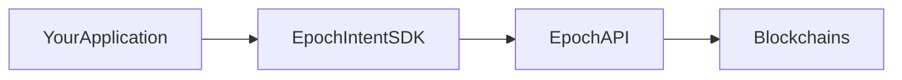
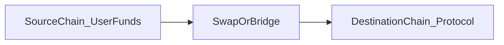

# Architecture

This page describes Epoch from an **integrator's perspective** — what your app talks to and what happens when a user submits an intent. It does not cover Epoch's internal infrastructure.

***

## System boundary



Your application integrates with:

1. **`EpochIntentSDK`** — TypeScript SDK (`@epoch-protocol/epoch-intents-sdk`)
2. **Epoch HTTP API** — REST endpoints under `/api/v1`
3. **User wallet** — viem/wagmi `walletClient` for signing

You do **not** call Epoch's internal solver or inventory services directly.

***

## Multi-step paths (conceptual)

Epoch may compose several steps into one intent:



Example path for a cross-chain raffle ticket purchase:

```
Polygon USDC  →  swap/bridge  →  Base payment token  →  buyTickets()
```

You submit a single task; Epoch selects and executes the path. Use `findPathsForIntent` or the quote response to inspect the planned route.

***

## End-to-end example: cross-chain raffle ticket

This mirrors the [Kismet](https://app.kismet.today) integration pattern.

### Setup

| Role              | Chain             | Example                         |
| ----------------- | ----------------- | ------------------------------- |
| User funds        | Polygon (137)     | USDC                            |
| Raffle / protocol | Base (8453)       | Payment token + raffle contract |
| User wallet       | Any connected EOA | Signs on source chain           |

### Steps

1. User selects source chain and token in your UI.
2. App calls `getTaskData` with `TaskType.ProtocolInteraction`, destination Base, and raffle `extraData`.
3. App calls `getIntentQuote` with `tokenInAmount: "0"` and `minTokenOut` set to the fixed ticket cost (reverse quote).
4. User reviews quote (input USDC amount, path preview).
5. App calls `solveIntent` with the quote; user signs in wallet.
6. App polls `getIntentStatus` every few seconds until complete.
7. User holds tickets on Base.

### Two-chain mental model

| Concept               | Meaning                                                    |
| --------------------- | ---------------------------------------------------------- |
| **Source chain**      | Where the user's wallet is connected and input tokens live |
| **Destination chain** | Where the protocol action executes (raffle on Base)        |

Your UI should make this distinction clear — users may need to switch to the source chain before signing.

***

## Key payloads

### Intent request (API level)

When calling the API directly, an intent includes:

| Field        | Description                                 |
| ------------ | ------------------------------------------- |
| `sender`     | User's wallet address                       |
| `approvals`  | Token approvals required on involved chains |
| `task`       | Base64-encoded task data                    |
| `constraint` | Optional execution constraints              |
| `chainIds`   | Chains involved in the intent               |
| `nonce`      | From `POST /getNonce`                       |
| `signature`  | User's signature over the intent            |

Using the SDK, these fields are assembled automatically during `solveIntent`.

### Task data (SDK level)

Built via `getTaskData`:

| Field                    | Description                                      |
| ------------------------ | ------------------------------------------------ |
| `depositTokenAddress`    | Input token on source chain                      |
| `tokenInAmount`          | Input amount (`"0"` for reverse quotes)          |
| `outputTokenAddress`     | Target token on destination chain                |
| `minTokenOut`            | Minimum output (fixed amount for reverse quotes) |
| `destinationChainId`     | Target chain ID                                  |
| `protocolHashIdentifier` | Protocol identifier hash                         |
| `recipient`              | Address receiving output on destination          |

### Quote response

| Field                  | Description                           |
| ---------------------- | ------------------------------------- |
| `success`              | Whether quoting succeeded             |
| `tokenIn` / `tokenOut` | Resolved amounts                      |
| `path`                 | Execution path modules                |
| `resourceLockRequired` | Whether Compact lock is needed        |
| `transactions`         | Preview of transactions user may sign |

### Execution status

Polled via `getIntentStatus(userAddress, nonce)` or `GET /getIntentTransactionStatus`. Returns per-transaction status, chain ID, and transaction hash when available.

***

## Pathfinding

* Integrators **do not configure paths manually**.
* Submit a task; Epoch's orchestrator finds compatible routes across supported chains and protocol modules.
* Use **`getIntentQuote`** to preview the path and amounts before execution.
* Use **`POST /findPathsForIntent`** for path discovery without executing (API-level).

***

## Next steps

* [Quickstart](integration-guides/quickstart.md)
* [Protocol Interaction](integration-guides/protocol-interaction.md)
* [API Reference](05-api-reference.md)
