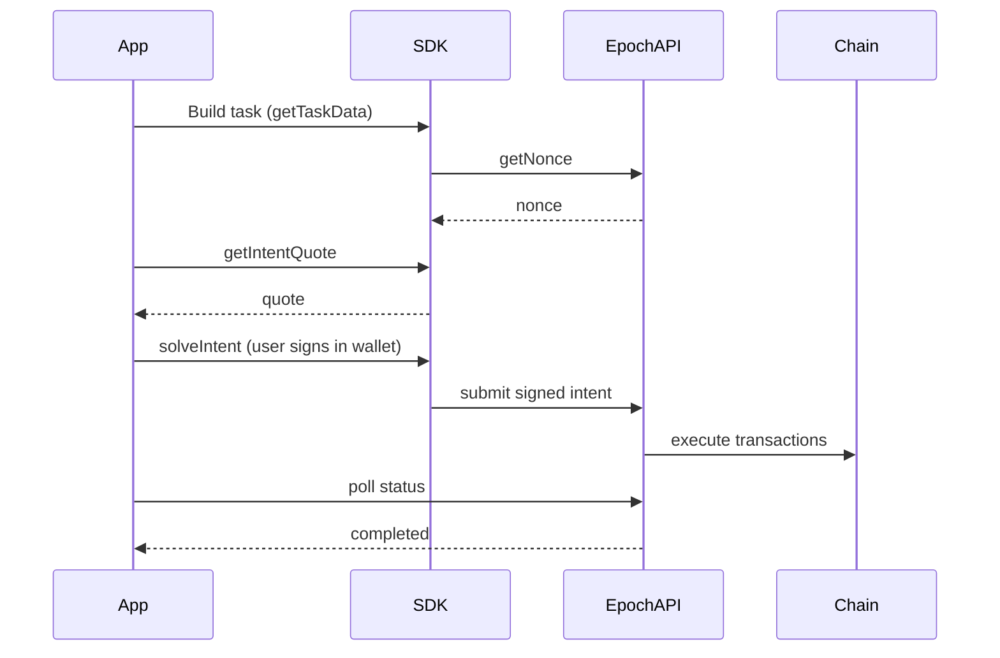
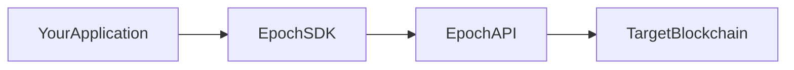

# Epoch Protocol — External Documentation Plan

**Audience:** Integrators, partners, and investors only. **Not included:** Internal engineering runbooks, service deep dives, deployment topology, repo maps, env vars, or ops content.

**Security principle:** Document _what integrators need to build_, not _how Epoch runs internally_. When in doubt, omit.

> Status: Validated against source code on 2026-06-08. See [Validation Notes](DOCUMENTATION_PLAN.md#validation-notes) for what was verified and corrected.

***

## What This Wiki Is (and Is Not)

| In scope                          | Out of scope                               |
| --------------------------------- | ------------------------------------------ |
| What Epoch does and why           | How Epoch deploys on AWS                   |
| How to integrate via SDK + API    | Internal repo structure and ports          |
| Logical request flows             | Treasury, liquidity fronting internals     |
| Public API contracts              | Solver microservice implementation         |
| Testnet/public contract addresses | Production secrets, RPC keys, internal DNS |
| Supported chains and capabilities | Runbooks, on-call, KMS/Secrets setup       |

***

## Security Rules (External Docs Only)

### Never include

* Credentials, API keys, JWTs, `.env` values, real wallet signatures
* Internal hostnames (`*.epoch.local`), VPC/subnet CIDRs, AWS resource names
* Treasury Safe addresses, signer EOAs, liquidity limits, slippage caps
* Production API base URLs (confirm the canonical public endpoint with the team before publishing)
* Real user data: intent IDs, addresses from logs, live calldata
* Internal source doc links (`REPOSITORY_FLOW.md`, `aws-deployment-setup/`, `UNDERSTANDING_THE_FLOW.md`)
* Implementation details that reveal attack surface (rate limits, WAF rules, queue internals)

### Safe to include

* Product narrative and user-facing flows
* Logical architecture with generic labels (`Orchestrator`, not internal repo names)
* Public API paths and **placeholder** JSON examples
* Protocol concepts: intent lifecycle, task types, `extraData` structure
* **Public integration contracts** (testnet factories, contracts integrators call directly)
* Keccak256 protocol identifiers (`keccak256("raffles")`)
* Error categories integrators can handle (validation, insufficient balance, quote expired)
* Reference app behavior (Kismet) at integration level

Use placeholders everywhere: `0xSender...`, `0xToken...`, `YOUR_API_KEY`.

### Pre-publish checklist

* [ ] No values copied from production config or repo constants
* [ ] All examples use fake addresses and amounts
* [ ] No internal service names, repo names, or localhost port maps
* [ ] Diagrams show user-visible components only
* [ ] No links to private GitHub repos or internal Notion pages

***

## Layer 0 — Home

### 0.1 Documentation Index

* One-paragraph: what Epoch Protocol is
* **Who this is for:** app developers integrating cross-chain intents, protocol partners, investors
* Three reading paths:
  * **5-minute overview** -> Layer 1 (investors, execs)
  * **Understand the system** -> Layer 2 + Layer 3
  * **Start building** -> Layer 4 + Layer 5
* Glossary link
* Changelog / last updated
* Support / contact for integration help

***

## Layer 1 — Overview (Investors + New Integrators)

### 1.1 What Problem Epoch Solves

* Users express intent ("swap USDC on Polygon -> buy raffle ticket on Base") in one signed action
* Epoch handles routing, quoting, and execution across chains
* Users sign with their own connected wallet (standard EOA via WalletConnect, MetaMask, etc.)

### 1.2 How It Works (One Page)

* Diagram: **Your App -> Epoch SDK -> Epoch API -> On-chain result**
* Plain-language glossary teaser: Intent, Task, Quote, Execution
* What Epoch provides vs what your app provides

### 1.3 Capabilities & Supported Networks

* Table: capability | status | example use case
  * Cross-chain swap
  * Cross-chain bridge
  * Swap + bridge combined
  * Protocol interaction (e.g. on-chain raffles)
  * Resource locks via The Compact (if offered to partners)
* Supported chains (mainnet + testnet) — names and chain IDs only (see [Validation Notes](DOCUMENTATION_PLAN.md#validation-notes) for verified list)

### 1.4 Reference Integration

* Kismet (kismet.today) — cross-chain raffle ticket purchase
* What it demonstrates: fund from any supported chain, execute protocol action on destination chain (Base)

### 1.5 Roadmap & Limitations (External-Safe)

* What is generally available vs beta
* Known integration caveats (e.g. "reverse quotes required for fixed-amount purchases")
* **Do not** list internal bugs, stub implementations, or doc drift

***

## Layer 2 — Core Concepts

### 2.1 Glossary

* Intent, Task, Path, Nonce, Approval, Constraint
* `sender` — the user's connected wallet address (EOA)
* Quote, Execution, Status polling
* Protocol interaction, `extraData`
* Resource lock / Compact (if relevant to partners)

### 2.2 Intent Lifecycle



* When to quote first vs submit directly
* Client-side vs server-side execution (conceptual; resource-lock path is server-coordinated)

### 2.3 Task Types

* Swap, Bridge, Swap-and-bridge, Protocol interaction
* What each means for your integration

### 2.4 Authentication & Signing

* User connects a standard wallet (EOA) — no smart wallet deployment required
* The SDK uses a viem `walletClient`; the user signs intent transactions in their wallet
* `sender` in API requests is the user's wallet address
* **API authentication is required**: all `/api/v1` routes sit behind auth middleware. Document the partner process to obtain an API key — **no** token format or internal header names

***

## Layer 3 — Architecture (External View)

**Goal:** Help integrators understand the system boundary — not Epoch's internal microservices.

### 3.1 Logical Architecture



* Optional second diagram showing multi-step paths conceptually: "Epoch may compose swap + bridge + protocol action into one intent"
* **Do not** expose internal solver names, inventory service, or service mesh

### 3.2 End-to-End Example — Cross-Chain Raffle Ticket

1. User on Polygon wants to buy tickets on a Base raffle
2. App builds a protocol-interaction task with raffle `extraData` (via `getTaskData`)
3. App calls `getIntentQuote` (reverse quote for fixed ticket cost)
4. User confirms -> `solveIntent` (signs in wallet)
5. App polls intent status until complete
6. User receives tickets on Base

### 3.3 Key Payloads (Integrator View)

* Intent request shape (`sender`, approvals, task, constraint, signature)
* Task encoding (base64) — link to SDK helpers, don't dump internal ABI
* `extraData` for protocol interactions: protocol hash, action hash, action-specific fields
* Quote response: what integrators display (amounts in, amounts out, fees if exposed)
* Execution status values

### 3.4 Pathfinding (Conceptual)

* Epoch finds a route across supported chains and protocols
* Integrators do not configure paths — they submit a task and receive quotes
* `findPathsForIntent` if exposed: what it returns and when to use it

***

## Layer 4 — Integration Guides

### 4.1 Quickstart

* Prerequisites: Node/React app, wallet connection (wagmi, RainbowKit, etc.), Epoch API access
* Install SDK (`@epoch-protocol/epoch-intents-sdk`)
* Initialize with `apiBaseUrl`, `walletClient`, `publicClient`
* Minimal example: connect wallet -> build task -> quote -> solve intent
* Link to sandbox/testnet

### 4.2 SDK Guide

* SDK class: `CompactSDK` (published as `@epoch-protocol/epoch-intents-sdk`)
* Constructor config: `apiBaseUrl`, `walletClient`, `publicClient`
* Core methods (verified against source):
  * `getTaskData` — build the task payload
  * `getIntentQuote` — fetch a quote (supports reverse quotes)
  * `solveIntent` — sign and submit for execution
  * `getIntentStatus` — poll execution status
  * `retryIntentSolve` — retry a failed solve
  * `getDepositedBalances`, deposit/withdrawal helpers (Compact flows)
  * `getHealthCheck`
* Note: nonce retrieval and signing happen inside the SDK flow (the SDK calls `getNonce` and signs via `walletClient`); these are not separate public SDK methods
* Execution status polling pattern (interval, terminal states)
* Wallet integration: connect user's EOA via standard wallet libraries — **no** smart wallet creation or deployment steps

### 4.3 Swap & Bridge Integration

* Task types and when to use each
* Forward quotes vs reverse quotes (`tokenInAmount: "0"`, fixed output)
* Approvals: what tokens/chains need pre-approval
* Displaying quotes to users

### 4.4 Protocol Interaction Integration

* Defining your protocol: `keccak256("yourProtocol")` and `keccak256("yourAction")`
* `extraData` JSON schema (document per supported action)
* Supported actions today: `buyTicket`, `createRaffle` (raffles protocol)
* Partner onboarding: how to request new protocol support

### 4.5 Compact / Resource Locks (If Offered)

* When resource lock is required
* Session and attestation flow (integrator steps only)
* **No** internal allocator URLs or admin endpoints

### 4.6 Error Handling

* HTTP status codes integrators will see
* Error categories: validation, nonce, signature, balance, quote expired, execution failed
* Retry guidance (safe vs unsafe retries; `retryIntentSolve` semantics)
* **No** internal error codes or stack traces

### 4.7 Reference Implementation

* Kismet integration patterns (external-safe summary):
  * Two-chain model: destination chain (where protocol lives, Base) vs source chains (where user funds)
  * Widget flow: quote -> confirm -> poll
* Link to public app, not private repo internals

***

## Layer 5 — API Reference

**Source:** Public SIO API only ([epoch-sio/docs/openapi.yaml](epoch-sio/docs/openapi.yaml), [epoch-sio/README.md](epoch-sio/) — sanitized).

### 5.1 Base URL & Authentication

* Public base path: `/api/v1`
* Health probes at root: `GET /health`, `GET /ready`
* **Auth required** on all `/api/v1` routes; document the partner key-request process (not token internals)

### 5.2 Endpoints (verified against `src/routes/intent.routes.ts`)

| Endpoint                                                | Method | Purpose                                         |
| ------------------------------------------------------- | ------ | ----------------------------------------------- |
| `/api/v1/getNonce`                                      | POST   | Obtain nonce before signing                     |
| `/api/v1/solveIntent`                                   | POST   | Submit signed intent for execution              |
| `/api/v1/findPathsForIntent`                            | POST   | Discover possible routes                        |
| `/api/v1/checkIfResourceLockRequiredAndGetTransactions` | POST   | Planning: check if resource lock is needed      |
| `/api/v1/getIntents`                                    | GET    | List intents                                    |
| `/api/v1/getIntentTransactionStatus`                    | GET    | Poll execution status                           |
| `/health`, `/ready`                                     | GET    | Availability probes (root, not under `/api/v1`) |

Internal/utility routes (`/registerEvent`, `/echo`) should **not** be published externally.

Per endpoint:

* Request schema (placeholder examples)
* Response schema
* Error responses
* Idempotency / retry notes where relevant

### 5.3 Intent Status

* Poll via `/getIntentTransactionStatus`
* Status values and what they mean for UX
* Typical completion times (ranges, not internal SLAs)

### 5.4 Webhooks (If Applicable)

* Document only if publicly offered; otherwise omit

**Explicitly excluded from external API reference:**

* Solver `/quote` API (Epoch-internal)
* Inventory service API
* Internal allocator admin routes
* `/registerEvent`, `/echo`

***

## Layer 6 — Appendices

### 6.1 Supported Chains & Tokens

Verified from the Kismet reference integration (`chance-chain/src/lib/epoch.ts`):

* **Source chains (mainnet):** Polygon (137), Optimism (10), Arbitrum (42161)
* **Source chains (testnet):** Ethereum Sepolia (11155111), Base Sepolia (84532), Optimism Sepolia (11155420)
* **Destination (raffles):** Base (8453), Base Sepolia (84532)
* Confirm the full canonical supported-chain list with the team before publishing (solver constants may add more)
* How to request additional chains/tokens

### 6.2 Public Contract Addresses

* **Confirmed safe to list:** contracts integrators interact with directly (e.g. raffle factory, protocol registry) — mainnet and testnet
* Include a per-chain table: contract name | chain | address | block explorer link
* **Still excluded:** treasury Safe, executor/settlement EOAs, and internal deployer addresses (per team direction, only integration-facing contracts are listed)

### 6.3 Protocol Identifiers

* Table: protocol name | keccak256 hash | supported actions
* Example: `raffles` -> hash -> `buyTicket`, `createRaffle`

### 6.4 FAQ

**Investors:**

* What is Epoch vs a bridge vs a DEX aggregator?
* What chains are supported?
* Is Epoch custodial?

**Integrators:**

* What wallet do users need? (standard EOA — MetaMask, Rainbow, etc.)
* How do reverse quotes work?
* How long does execution take?
* How do I get testnet access?
* How do I add my protocol?

### 6.5 Changelog

* Public API changes, new chains, new protocol actions
* Breaking changes with migration notes

***

## Recommended Notion Structure

Single external-facing workspace:

```
Epoch Protocol (External Docs)
├── Home
├── 1. Overview
├── 2. Core Concepts
│   └── Glossary
├── 3. Architecture
├── 4. Integration Guides
│   ├── Quickstart
│   ├── SDK Reference
│   ├── Swap & Bridge
│   ├── Protocol Interaction
│   └── Error Handling
├── 5. API Reference
└── 6. Appendices
    ├── Chains & Tokens
    ├── Public Contracts
    ├── Protocol Identifiers
    ├── FAQ
    └── Changelog
```

***

## Writing Priority

1. **Layer 1 + Layer 2** — orients investors and new integrators
2. **Layer 4.1 Quickstart + Layer 5.1–5.2** — unblocks first integration
3. **Layer 3.2 + Layer 4.4** — cross-chain protocol interaction (Kismet-style)
4. **Layer 4.3 + Layer 6** — swap/bridge reference and appendices
5. **Layer 4.6 + FAQ** — polish for partner self-service

***

## Content to Pull From (With Redaction)

| Internal source                                | Use externally              | Strip                                                                                 |
| ---------------------------------------------- | --------------------------- | ------------------------------------------------------------------------------------- |
| `epoch-sio/docs/openapi.yaml`                  | Endpoint list, schemas      | Internal-only routes (`/echo`, `/registerEvent`)                                      |
| `epoch-sio/README.md`                          | API request/response shapes | Real addresses, prod URLs, **outdated smart-wallet / ERC-7579 section — do not copy** |
| `smallocator/sdk/README.md`                    | SDK init + method names     | Example secrets, `localhost` URLs                                                     |
| Kismet public behavior                         | Integration example         | Private repo paths                                                                    |
| **Do not use externally**                      |                             |                                                                                       |
| `epoch-sio/UNDERSTANDING_THE_FLOW.md`          | —                           | Internal phases, queue, solvers                                                       |
| `dex-solver/REPOSITORY_FLOW.md`                | —                           | Treasury, routing internals                                                           |
| `aws-deployment-setup/architecture-diagram.md` | —                           | Entire doc is internal                                                                |

***

## Intentionally Excluded (Internal Only — Do Not Publish)

* Repository map with service ports
* Service deep dives (SIO, dex-solver, multi-solver, inventory, etc.)
* Operations & infrastructure (AWS, ECS, KMS, runbooks)
* Environment variable reference
* "Adding a new solver" / internal codebase extension guides
* Source docs index linking to private repos
* Smart wallets, ERC-7579 Epoch Module, Safe / 7702 / delegator wallet flows (deprecated for users)

Internal team documentation should live separately (private Notion, Confluence, or repo READMEs) and is out of scope for this structure.

***

## Validation Notes

What was checked against source on 2026-06-08, and corrections applied to this plan:

* **API endpoints** — verified against `epoch-sio/src/routes/intent.routes.ts`. Corrected the status endpoint name to `/getIntentTransactionStatus` (the prior draft said `getIntentStatus`), added `/checkIfResourceLockRequiredAndGetTransactions` and `/getIntents`, and flagged `/echo` + `/registerEvent` as non-public.
* **Auth** — confirmed `router.use(authMiddleware)` wraps all `/api/v1` routes, so API auth is required (prior draft was unsure).
* **SDK methods** — verified against `smallocator/sdk/src/index.ts`. The SDK class is `CompactSDK`. Real methods: `getTaskData`, `getIntentQuote`, `solveIntent`, `getIntentStatus`, `retryIntentSolve`, deposit/withdraw helpers, `getDepositedBalances`, `getHealthCheck`. Removed non-existent methods from the prior draft (`createIntent`, `signIntent`, `submitIntent`, `getPathsForIntent` as SDK methods); clarified that `getNonce` is an API endpoint and signing happens internally via `walletClient`.
* **Wallet model** — confirmed the SDK uses a viem `walletClient` (EOA). No smart-wallet deployment in the user flow; smart-wallet/ERC-7579 content removed.
* **Chains** — verified source/destination chain IDs from `chance-chain/src/lib/epoch.ts`. Flagged that solver constants may add more; confirm canonical list before publishing.

### Open items to confirm with the team before publishing

* Canonical public API base URL
* Canonical published SDK package name and whether `CompactSDK` is the external-facing export name
* Full supported-chain/token list beyond the Kismet reference set
* Whether resource-lock/Compact flows are offered to external partners
* ~~Public contract addresses safe to list~~ — resolved: integration-facing contract addresses are safe to list; treasury/signer EOAs remain excluded
