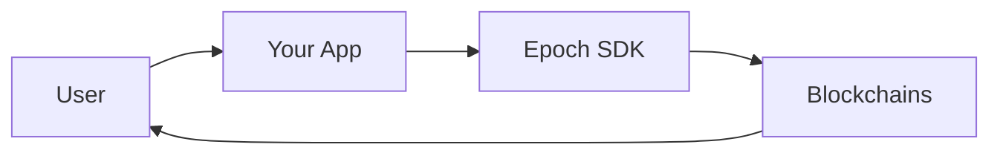

# Overview

## What problem Epoch solves

Users increasingly hold assets on one chain but want to act on another — swap tokens, bridge value, or call a protocol (buy a ticket, deposit into a pool, etc.). Today that usually means multiple manual steps: bridge, swap, approve, execute.

Epoch collapses that into a **single signed intent**. The user connects their wallet, confirms what they want, and Epoch handles routing, quoting, and execution across chains.

Example: a user on Polygon wants to buy raffle tickets on Base. They pick USDC on Polygon, sign once, and receive tickets on Base — without managing bridges or separate swap UIs.

***

## How it works

1. **Your app** builds a task describing the desired outcome (token in, token out, destination chain, optional protocol action).
2. **The SDK** fetches a quote, coordinates wallet signatures, and submits the intent.
3. **Epoch** finds a path, executes transactions, and reports status via the SDK.
4. **The user** sees the result on the destination chain.

Users sign with a **standard wallet** (MetaMask, Rainbow, WalletConnect, etc.). No smart-wallet deployment is required.

***

## Capabilities

| Capability               | Description                                        | Example                                 |
| ------------------------ | -------------------------------------------------- | --------------------------------------- |
| Cross-chain swap         | Exchange token A on chain X for token B on chain Y | USDC on Polygon → USDC on Base          |
| Cross-chain bridge       | Move the same asset across chains                  | USDC on Arbitrum → USDC on Optimism     |
| Swap + bridge            | Combined routing in one intent                     | WETH on Optimism → USDC on Base         |
| Protocol interaction     | Execute an on-chain action after funding           | Buy raffle tickets on Base from Polygon |
| Resource locks (Compact) | Collateral-backed intents via The Compact          | Partner flows requiring locked deposits |

***

## Supported networks

Epoch supports a growing set of **source chains** (where the user holds funds) and **destination chains** (where the outcome is delivered).

See the full list in [Supported Chains & Tokens](supported-chains-and-tokens.md).

**Mainnet source chains (reference integration):** Polygon, Optimism, Arbitrum One\
**Testnet source chains:** Ethereum Sepolia, Base Sepolia, Optimism Sepolia\
**Destination (raffles example):** Base, Base Sepolia

Contact the Epoch team to confirm availability for your use case or to request new chains.

***

## Reference integration: Kismet

[Kismet](https://app.kismet.today) is a live application built on Epoch:

* Raffles are deployed on **Base** (mainnet) or **Base Sepolia** (testnet).
* Users can fund and buy tickets from **Polygon, Optimism, or Arbitrum** (and testnets).
* The app uses the Epoch SDK with a quote-then-confirm flow for fixed-price ticket purchases.

This is the recommended pattern for **protocol interaction** integrations. Details: [Protocol Interaction Guide](integration-guides/protocol-interaction.md).

***

## Limitations (integration-facing)

* **Reverse quotes** are required when the output amount is fixed (e.g. ticket price × quantity). Pass `tokenInAmount: "0"` and set `minTokenOut` to the required output.
* **Execution time** depends on cross-chain path complexity; poll intent status rather than assuming instant completion.
* **Supported tokens** vary by chain; see [Supported Chains & Tokens](supported-chains-and-tokens.md).
* **New protocols** require Epoch partner onboarding before `extraData` actions are routable.

***

## Protocol products

Epoch ships supporting tools alongside the SDK and allocator:

| Product | Description |
| ------- | ----------- |
| [User Dashboard](https://userdashboard.epochprotocol.xyz/) | View Compact deposits, mint testnet tokens, and manage forced withdrawals. [Source](https://github.com/epochprotocol/epoch-user-dashboard). |

See [Links](links.md) for all official URLs.

***

## Next steps

* [Core Concepts](02-core-concepts.md) — glossary and intent lifecycle
* [Architecture](03-architecture.md) — external system view
* [Quickstart](integration-guides/quickstart.md) — first integration
* [Integration Examples](integration-examples.md) — reference projects
