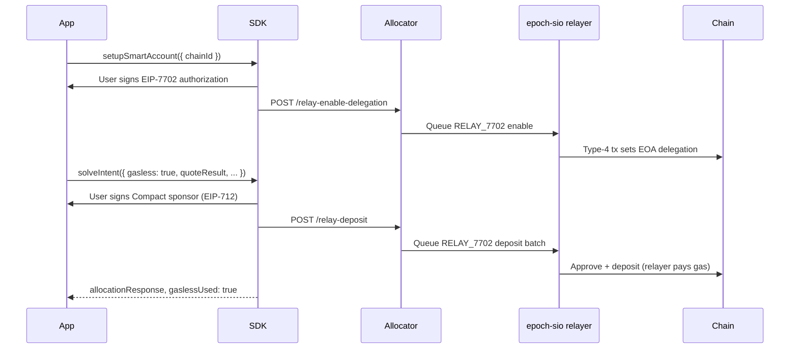

# Gasless EIP-7702 Compact Deposits

Optional **gasless Compact deposits** on testnet: the user signs EIP-7702 authorization and Compact sponsor data; Epoch's relayer broadcasts approve + deposit transactions so the user does not pay gas for those steps.

This applies to the **Compact deposit phase** inside `solveIntent` (approve ERC-20, deposit to The Compact, register). Cross-chain intent execution after deposit still follows the normal solver path.

***

## When to use gasless

| Scenario | Recommendation |
| -------- | -------------- |
| Testnet demos, scripts, agent wallets with a local private key | Enable gasless relay (`gasless: true`) |
| Production MetaMask / browser wallet users | Use standard wallet-paid deposits; widget batches via EIP-5792 when supported |
| Headless CI / integration tests | Local signer + `setupSmartAccount` + `solveIntent({ gasless: true })` |

Gasless relay is **testnet-only** today. Mainnet support is not documented here until explicitly announced.

***

## Supported testnet chains

Gasless Compact deposits are enabled on these chain IDs (must match allocator `GASLESS_SUPPORTED_CHAIN_IDS`):

| Network | Chain ID |
| ------- | -------- |
| Base Sepolia | 84532 |
| Ethereum Sepolia | 11155111 |
| Optimism Sepolia | 11155420 |

Check live status:

```http
GET {apiBaseUrl}/gasless-status
```

Response includes `enabled`, `supportedChainIds`, and `relayerAddress`.

***

## How it works



### Wallet modes

| Wallet type | `account.type` | Gasless relay UI | Deposit path |
| ----------- | -------------- | ---------------- | ------------ |
| **Local signer** (viem `privateKeyToAccount`) | `local` | Shown | SIO relay after 7702 setup |
| **Injected wallet** (MetaMask, Rainbow, etc.) | `json-rpc` | Hidden | Wallet-paid; EIP-5792 atomic batch when supported |

Injected wallets **cannot** use SIO gasless relay for 7702 enable — MetaMask must sign the authorization itself. The SDK falls back to wallet-paid `depositToCompact` with batching.

***

## SDK integration

**Package:** `@epoch-protocol/epoch-intents-sdk` (gasless APIs ship on the `feat/gasless-7702` branch; publish target `1.0.27+`).

### Constructor options

```typescript
new EpochIntentSDK({
  apiBaseUrl: "https://testnet-dev.epochprotocol.xyz",
  walletClient,
  gaslessDefault: false, // when true, solveIntent uses relay unless gasless: false
});
```

### 1. Probe wallet support

```typescript
const status = await sdk.getWalletGaslessStatus(chainId);
// status.delegation: "none" | "epoch" | "other"
// status.is7702Capable, status.needsSetup, status.canRelayDeposit, ...
```

Or import helpers:

```typescript
import {
  getWalletGaslessStatus,
  GASLESS_SUPPORTED_CHAIN_IDS,
  shouldUseGaslessRelay,
} from "@epoch-protocol/epoch-intents-sdk";
```

### 2. One-time smart-account setup (local signers)

```typescript
const setup = await sdk.setupSmartAccount({ chainId: 84532 });
if (!setup.ok) {
  throw new Error(setup.reason ?? "Smart account setup failed");
}
// setup.delegation === "epoch", setup.txHash from relay (local accounts)
```

Alternative high-level helper:

```typescript
const ready = await sdk.ensureGaslessReady({ chainId: 84532 });
```

### 3. Gasless solve

```typescript
const result = await sdk.solveIntent({
  isNative: false,
  sponsorAddress: account.address,
  taskTypeString,
  intentData,
  quoteResult,
  gasless: true, // strict: throws on relay failure (no wallet fallback)
  onExecutionStatus: (s) => console.log(s.phase),
});

console.log(result.gaslessUsed); // true when relay handled the deposit
```

| `gasless` param | Behavior |
| --------------- | -------- |
| `true` | Use relay; **throw** if relay unavailable |
| `false` | Wallet-paid deposit |
| omitted | Uses `gaslessDefault`; may fall back to wallet-paid on relay failure |

### Standalone gasless deposit

For custom flows without full `solveIntent`:

```typescript
await sdk.gaslessDepositToCompact({
  chainId: 84532,
  tokenAddress,
  amount: depositAmountWei,
  // ... Compact sponsor fields from quote
});
```

### Errors

`GaslessUnavailableError` (`code: "GASLESS_UNAVAILABLE"`) — chain disabled, wallet not delegated, relayer down, or relay rejected. See [Error Handling](error-handling.md).

***

## Local private-key wallet (dev / test)

Use a viem local account so `walletClient.account.type === "local"` and `signAuthorization` is available:

```typescript
import { createWalletClient, http } from "viem";
import { privateKeyToAccount } from "viem/accounts";
import { baseSepolia } from "viem/chains";

const account = privateKeyToAccount(process.env.PRIVATE_KEY as `0x${string}`);
const walletClient = createWalletClient({
  account,
  chain: baseSepolia,
  transport: http(),
});

const sdk = new EpochIntentSDK({ apiBaseUrl, walletClient });
await sdk.setupSmartAccount({ chainId: baseSepolia.id });
// ... getTaskData → getIntentQuote → solveIntent({ gasless: true })
```

Runnable examples in `smallocator/sdk`:

| Script | Command |
| ------ | ------- |
| `test/integration-gasless-example.ts` | `pnpm example:gasless` |
| `test/local-wallet-gasless.ts` | `pnpm example:local-wallet` |

**compact-demo-epoch** adds a UI **Local signer** tab (private key + chain picker) so gasless can be tested without MetaMask. See [compact-demo-epoch](../integration-examples.md#compact-demo-epoch).

***

## Widget integration

`@epoch-protocol/epoch-intent-widget` exposes gasless on Pay/Swap flows (`feat/gasless-7702`):

| Prop | Default | Description |
| ---- | ------- | ----------- |
| `allowGasless` | `true` | Show gasless toggle when wallet + chain support it |
| `gasless` | `false` | Initial or controlled gasless state |

The widget probes 7702 capability via `useGaslessWallet`, renders `GaslessEnableButton`, and passes `gasless` into the intent flow. Injected wallets skip the relay UI and use wallet batching.

See [Widget Integration Guide](widget-integration.md#gasless-deposits-testnet).

***

## Allocator API (gasless routes)

Public routes on the smallocator service (no SIO auth token required from the client — allocator forwards to SIO):

| Method | Path | Purpose |
| ------ | ---- | ------- |
| `GET` | `/gasless-status` | Feature flag, supported chains, relayer address |
| `POST` | `/relay-enable-delegation` | Broadcast 7702 enable after user signs authorization |
| `POST` | `/relay-deposit` | Relay approve + Compact deposit + register batch |

**Operator requirements** (not integrator-facing env vars, but needed for gasless to work on a deployment):

* `GASLESS_ENABLED=true` on smallocator
* Funded relayer key on epoch-sio (`RELAYER_PRIVATE_KEY` or `EXECUTOR_PRIVATE_KEY`)
* SIO `RELAY_7702` queue processing enabled

***

## Related PRs (gasless-7702)

| Repository | Branch | Scope |
| ---------- | ------ | ----- |
| [smallocator](https://github.com/epochprotocol/smallocator) | `feat/gasless-7702` | SDK gasless APIs, `/relay-*` routes, deposit relay |
| [epoch-sio](https://github.com/epochprotocol/epoch-sio) | `feat/gassless-7702` | `RELAY_7702` queue, type-4 relay broadcaster |
| [epoch-commons-sdk](https://github.com/epochprotocol/epoch-commons-sdk) | `feat/gassless-7702` | Shared constants / graph updates |
| [epoch-flows-sdk](https://github.com/epochprotocol/epoch-flows-sdk) | `feat/gasless-7702` | `CreatePaySessionOptions.gasless`, status events |
| [epoch-widget](https://github.com/epochprotocol/epoch-widget) | `feat/gasless-7702` | `GaslessEnableButton`, `useGaslessWallet`, widget props |
| [compact-demo-epoch](https://github.com/Man-Jain/compact-demo-epoch) | `feat/gasless-7702` | Demo UI: gasless toggle + local signer form |

***

## Next steps

* [SDK Integration Guide](sdk-integration-guide.md) — full checklist including gasless
* [SDK Reference](sdk-reference.md) — method signatures
* [Integration Examples](../integration-examples.md) — compact-demo-epoch reference UI
* [Supported Chains & Tokens](../supported-chains-and-tokens.md) — testnet chain IDs
