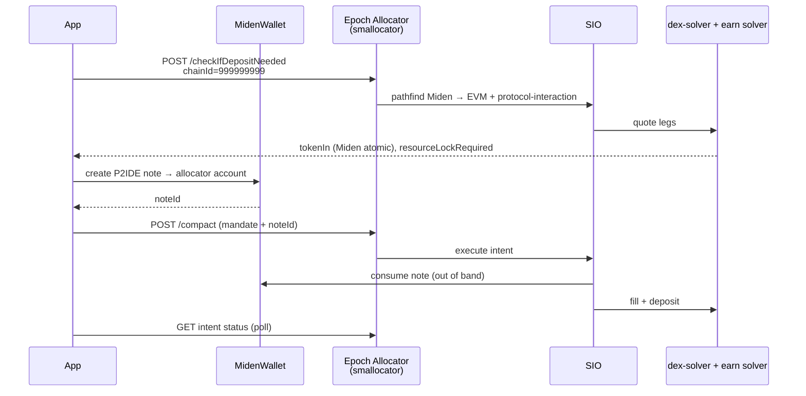

# Miden → EVM Lending Integration

Use **`TaskType.ProtocolInteraction`** with **Miden P2IDE note collateral** to fund an **earn / lending deposit** on an EVM chain (e.g. dummy-lending on Sepolia) while the user pays from **Miden testnet USDC**.

This guide is written for **Miden wallet / dApp integrators**. It mirrors the production flow implemented in the [Epoch Intent Widget](https://github.com/epoch-protocol/epoch-widget) earn mode.

---

## What the user experience looks like

1. User connects an **EVM wallet** (intent sponsor / recipient on the lending market).
2. User connects a **Miden wallet** and selects Miden USDC as the funding source.
3. App requests a **quote** from the Epoch allocator (smallocator).
4. User confirms; app creates a **P2IDE note** on Miden paying the quoted amount to the Epoch allocator account.
5. Epoch **SIO** consumes the note, **fronts EVM liquidity**, runs **swap/bridge** (if needed), and executes the **lending deposit** on the destination chain.
6. App **polls intent status** until complete.

There is **no EVM ERC-20 approval** for Miden-funded deposits. Collateral is the Miden note, not Compact on-chain registration.

---

## Architecture



| Layer               | Role                                                                                      |
| ------------------- | ----------------------------------------------------------------------------------------- |
| **Your app**        | Builds intent mandate, overrides origin chain to Miden, implements `createMidenP2IDNote`  |
| **Epoch allocator** | Quote (`/checkIfDepositNeeded`), submit (`/compact`), status                              |
| **SIO**             | Multi-leg routing: `FillerSwapAndBridge` → `protocol-interaction` (deposit)               |
| **Miden note**      | User collateral; recipient **must** be allocator P2ID account from `GET /miden-recipient` |

---

## Prerequisites

| Requirement             | Notes                                                                            |
| ----------------------- | -------------------------------------------------------------------------------- |
| **EVM wallet**          | Sponsor address on the intent mandate (`recipient` = same user EVM address)      |
| **Miden wallet**        | Must support sending a **public P2IDE** note to a hex account id                 |
| **Epoch allocator URL** | Testnet e.g. `http://localhost:3000` or hosted allocator                         |
| **Packages**            | `@epoch-protocol/epoch-intents-sdk`, `@epoch-protocol/epoch-commons-sdk`, `viem` |
| **Network**             | Testnet only today (dummy-lending + Miden testnet)                               |

Install:

```bash
npm install @epoch-protocol/epoch-intents-sdk @epoch-protocol/epoch-commons-sdk viem
# Optional UI: @epoch-protocol/epoch-intent-widget + wagmi + @tanstack/react-query
```

---

## Critical constants

| Constant                 | Value                                        | Meaning                                                  |
| ------------------------ | -------------------------------------------- | -------------------------------------------------------- |
| `MIDEN_VIRTUAL_CHAIN_ID` | `999999999`                                  | Origin chain id for **all** Miden→EVM allocator requests |
| Miden USDC faucet id     | `0x8ddb61e056105cf119634d919be743`           | Default testnet faucet (6 decimals)                      |
| Miden USDC decimals      | **6**                                        | Always use 6 for `tokenInAmount` and P2ID note amount    |
| EVM `tokenIn` sentinel   | `0x0000000000000000000000000000000000000000` | Signals Miden source (not native ETH)                    |
| `midenNoteType`          | `P2IDE`                                      | Reclaimable note; include `midenReclaimHeight`           |
| `protocolHashIdentifier` | `keccak256("dummy-lending")`                 | See [Protocol hash](#protocol-hash)                      |

**Amount rule:** Miden-side amounts are **always in 6-decimal atomic units** (1 USDC = `1_000_000`). EVM market underlyings may use 18 decimals; Epoch converts internally during quoting. **Do not** scale Miden amounts to 18 decimals yourself.

---

## Protocol hash

For **dummy-lending** test markets:

```typescript
import { keccak256, toBytes } from "viem";

const protocolHashIdentifier = keccak256(toBytes("dummy-lending"));
// 0x7a2ccf6fa10307c054284131a341a8d8cbd10ec7d3cc469fbf369c40fd86d0f9
```

For **1delta** mainnet markets, use `keccak256(toBytes("1delta"))` instead.

---

## Market identifier (`marketUid`)

Lending markets are addressed by a colon-delimited uid embedded in `extraData.marketUid`:

```
DUMMY_LENDING:{chainId}:{underlyingTokenAddress}
```

Example (USDC market on Ethereum Sepolia):

```
DUMMY_LENDING:11155111:0x2bb4ffd7e2c6d432b697554efd77fa13bdbefd69
```

| Field                    | Description                                                   |
| ------------------------ | ------------------------------------------------------------- |
| Prefix                   | `DUMMY_LENDING` → routes to dummy-lending earn solver         |
| `chainId`                | Chain where the lending market lives (`11155111`, `84532`, …) |
| `underlyingTokenAddress` | ERC-20 deposited into the vault (lowercase ok)                |

`destinationChainId` in the mandate must match the market chain. `outputTokenAddress` / `payAsset` must match the market underlying.

---

## Intent mandate (lending deposit)

### Task type

`TaskType.ProtocolInteraction`

### Core `intentData` fields

| Field                    | Miden deposit value                                                   |
| ------------------------ | --------------------------------------------------------------------- |
| `depositTokenAddress`    | `0x0000000000000000000000000000000000000000`                          |
| `tokenInAmount`          | User input in **Miden 6-dec** atomic units, e.g. `parseUnits("1", 6)` |
| `outputTokenAddress`     | Market underlying ERC-20                                              |
| `minTokenOut`            | `"0"` (forward quote from user Miden input)                           |
| `destinationChainId`     | Market chain id string, e.g. `"11155111"`                             |
| `protocolHashIdentifier` | `keccak256(toBytes("dummy-lending"))`                                 |
| `recipient`              | User EVM address (sponsor)                                            |

### `extraData` schema (lending + Miden)

```typescript
extraDataTypestring:
  "string marketUid,string action,string payAsset," +
  "string midenSourceAccount,string midenFaucetId," +
  "string midenNoteType,string midenNoteId,uint256 midenReclaimHeight";

extraData: {
  marketUid: "DUMMY_LENDING:11155111:0x2bb4ffd7e2c6d432b697554efd77fa13bdbefd69",
  action: "deposit",
  payAsset: "0x2bb4ffd7e2c6d432b697554efd77fa13bdbefd69",
  midenSourceAccount: "0x<user_miden_account_hex>",
  midenFaucetId: "0x8ddb61e056105cf119634d919be743",
  midenNoteType: "P2IDE",
  midenNoteId: "",                    // empty at quote time; filled after note creation
  midenReclaimHeight: "1000",         // blocks until user can reclaim unused note
}
```

| Miden field          | When set                                                                      |
| -------------------- | ----------------------------------------------------------------------------- |
| `midenSourceAccount` | Before quote — user's Miden account id (hex)                                  |
| `midenFaucetId`      | Before quote — faucet id for the asset sent in the note                       |
| `midenNoteId`        | **After** P2IDE creation — SDK writes this into the mandate before `/compact` |
| `midenReclaimHeight` | Before quote — P2IDE reclaim window                                           |

---

## Origin chain override (required)

The allocator SDK uses `walletClient.chain.id` as the intent **origin chain**. For Miden deposits you **must override** it to `999999999` even when the EVM wallet is connected to Sepolia:

```typescript
const MIDEN_VIRTUAL_CHAIN_ID = 999_999_999;

const midenWalletClient = {
  ...walletClient,
  chain: { ...walletClient.chain, id: MIDEN_VIRTUAL_CHAIN_ID },
};

const sdk = new EpochIntentSDK({
  apiBaseUrl: ALLOCATOR_URL,
  walletClient: midenWalletClient,
});
```

Without this, the allocator treats the flow as **Sepolia → Sepolia** instead of **Miden → Sepolia**.

---

## Headless SDK flow (full example)

```typescript
import { TaskType } from "@epoch-protocol/epoch-commons-sdk";
import {
  CollateralType,
  EpochIntentSDK,
} from "@epoch-protocol/epoch-intents-sdk";
import { keccak256, parseUnits, toBytes } from "viem";

const MIDEN_VIRTUAL_CHAIN_ID = 999_999_999;
const MIDEN_USDC_FAUCET = "0x8ddb61e056105cf119634d919be743";
const MIDEN_USDC_DECIMALS = 6;
const EVM_ZERO = "0x0000000000000000000000000000000000000000";

const marketUid =
  "DUMMY_LENDING:11155111:0x2bb4ffd7e2c6d432b697554efd77fa13bdbefd69";
const underlying = "0x2BB4FfD7E2c6D432b697554Efd77fA13bdbefd69";
const destinationChainId = "11155111";
const protocolHashIdentifier = keccak256(toBytes("dummy-lending"));

// --- 1. SDK with Miden origin chain ---
const sdk = new EpochIntentSDK({
  apiBaseUrl: "https://allocator.example.com",
  walletClient: {
    ...evmWalletClient,
    chain: { ...evmWalletClient.chain, id: MIDEN_VIRTUAL_CHAIN_ID },
  },
});

const sponsorAddress = evmUserAddress as `0x${string}`;
const depositAmountHuman = "1"; // 1 Miden USDC

// --- 2. Build mandate ---
const { taskTypeString, intentData } = await sdk.getTaskData({
  taskType: TaskType.ProtocolInteraction,
  intentData: {
    isNative: false,
    depositTokenAddress: EVM_ZERO,
    tokenInAmount: parseUnits(
      depositAmountHuman,
      MIDEN_USDC_DECIMALS,
    ).toString(),
    outputTokenAddress: underlying,
    minTokenOut: "0",
    destinationChainId,
    protocolHashIdentifier,
    recipient: sponsorAddress,
  },
  extraDataTypestring:
    "string marketUid,string action,string payAsset," +
    "string midenSourceAccount,string midenFaucetId," +
    "string midenNoteType,string midenNoteId,uint256 midenReclaimHeight",
  extraData: {
    marketUid,
    action: "deposit",
    payAsset: underlying,
    midenSourceAccount: midenUserAccountHex,
    midenFaucetId: MIDEN_USDC_FAUCET,
    midenNoteType: "P2IDE",
    midenNoteId: "",
    midenReclaimHeight: "1000",
  },
});

// --- 3. Quote ---
const quote = await sdk.getIntentQuote({
  sponsorAddress,
  taskTypeString,
  intentData,
  isNative: false,
});

if (!quote?.success) throw new Error("Quote failed");

// quote.resourceLockRequired === true for Miden
// quote.transactions === [] until submit (note created on submit)
// quote.tokenIn may differ from user input after routing (includes buffer) — use for P2ID amount

console.log("Miden collateral required:", quote.tokenIn);
console.log("Expected EVM deposit size:", quote.tokenOut);

// --- 4. Submit (creates P2IDE note, then POST /compact) ---
const result = await sdk.solveIntent({
  isNative: false,
  sponsorAddress,
  taskTypeString,
  intentData,
  quoteResult: quote,
  collateralType: CollateralType.Miden,
  midenFaucetId: MIDEN_USDC_FAUCET,
  midenSourceAccount: midenUserAccountHex,
  createMidenP2IDNote: async (faucetId, amountAtomic, allocatorAccountId) => {
    // Your Miden wallet integration — recipient MUST be allocatorAccountId
    // amountAtomic is a decimal string in Miden faucet decimals (6)
    const noteId = await sendPublicP2idenote({
      from: midenUserAccountHex,
      to: allocatorAccountId,
      faucetId,
      amount: Number(amountAtomic), // or BigInt path if your SDK supports it
    });
    return { success: true, noteId };
  },
});

// --- 5. Poll status ---
const nonce =
  result?.nonce ??
  result?.submittedIntentData?.nonce ??
  result?.allocationResponse?.nonce;

if (nonce) {
  const interval = setInterval(async () => {
    const status = await sdk.getIntentStatus(sponsorAddress, nonce.toString());
    if (
      status.some((s) =>
        ["completed", "finalized", "success"].includes(s.status ?? ""),
      )
    ) {
      clearInterval(interval);
    }
  }, 3000);
}
```

### `createMidenP2IDNote` contract

The SDK calls your callback **only after** quote confirms `resourceLockRequired`. Parameters:

| Param                | Type     | Description                                                                        |
| -------------------- | -------- | ---------------------------------------------------------------------------------- |
| `faucetId`           | `string` | Normalized hex faucet id                                                           |
| `amount`             | `string` | **Atomic Miden units (6 decimals)** — usually `quote.tokenIn` after reverse sizing |
| `allocatorAccountId` | `string` | From `GET {allocator}/miden-recipient` — **must** be note recipient                |

Return `{ success: true, noteId: "<note_id_string>" }` or `{ success: false, error: "..." }`.

The SDK fetches the allocator id automatically via `GET /miden-recipient` before invoking your callback.

---

## Widget integration (optional)

If you prefer a pre-built UI, use `@epoch-protocol/epoch-intent-widget` in **`mode="earn"`** and inject a Miden adapter:

```tsx
import {
  EpochIntentWidget,
  DEFAULT_MIDEN_FAUCET,
  type EarnMidenAdapter,
} from "@epoch-protocol/epoch-intent-widget";

const earnMiden: EarnMidenAdapter = {
  enabled: true,
  connected: midenWallet.connected,
  accountId: midenWallet.accountId?.hex,
  assets: [
    {
      faucetId: DEFAULT_MIDEN_FAUCET.faucetId,
      symbol: DEFAULT_MIDEN_FAUCET.symbol,
      decimals: DEFAULT_MIDEN_FAUCET.decimals,
      balance: midenUsdcBalance,
    },
  ],
  connect: () => midenWallet.connect(),
  createP2IDNote: async (faucetId, amount, allocatorId) => {
    // same as headless callback
    return { success: true, noteId };
  },
  reclaimHeight: 1000,
};

<EpochIntentWidget
  isOpen={open}
  onClose={() => setOpen(false)}
  api={{ baseUrl: ALLOCATOR_URL, positionsBaseUrl: POSITIONS_URL }}
  mode="earn"
  network="testnet"
  earnMiden={earnMiden}
  onSuccess={({ nonce }) => console.log("deposit settled", nonce)}
/>;
```

The widget handles origin-chain override, mandate encoding, quote debouncing, and status polling internally.

---

## Allocator HTTP surface

| Method | Path                             | Purpose                                                                    |
| ------ | -------------------------------- | -------------------------------------------------------------------------- |
| `POST` | `/checkIfDepositNeeded`          | Quote only — returns `resourceLockRequired`, `path`, `tokenIn`, `tokenOut` |
| `GET`  | `/miden-recipient`               | `{ midenP2IDRecipientAccountId }` — P2IDE payee                            |
| `POST` | `/compact`                       | Submit intent after note creation                                          |
| `GET`  | `/intent/status/:address/:nonce` | Poll execution (nonce is **decimal string** from submit response)          |

Quote request body includes `"chainId": "999999999"` for Miden-origin intents.

---

## Quote response semantics

| Field                  | Miden lending deposit                                                     |
| ---------------------- | ------------------------------------------------------------------------- |
| `resourceLockRequired` | `true`                                                                    |
| `transactions`         | `[]` at quote time (no EVM txs until submit)                              |
| `tokenIn`              | Miden collateral in **6-dec atomic units** (may include routing buffer)   |
| `tokenOut`             | Expected amount credited on EVM side (market underlying decimals)         |
| `path`                 | Multi-leg route, typically `FillerSwapAndBridge` → `protocol-interaction` |

Display `quote.tokenIn` formatted with **6 decimals** to the user before submit.

---

## P2IDE note checklist

- [ ] Recipient = `GET /miden-recipient` account id (allocator / SIO consumption target)
- [ ] Faucet id matches `extraData.midenFaucetId`
- [ ] Amount = SDK-provided `effectiveTokenInAmount` (from quote reverse path when applicable)
- [ ] Note type **P2IDE** with reclaim height set in mandate
- [ ] Wait for note finalization on Miden before `/compact` (SDK waits ~12s by default)
- [ ] `midenNoteId` written into mandate before submission

---

## Two-wallet model

| Wallet    | Chain                          | Responsibility                                                        |
| --------- | ------------------------------ | --------------------------------------------------------------------- |
| **Miden** | Miden testnet                  | Holds USDC faucet balance; signs P2IDE send                           |
| **EVM**   | Any (Sepolia, Base Sepolia, …) | Intent sponsor address; **not** used for token approval in Miden flow |

The EVM wallet does **not** need to be on the destination market chain for quoting, but must be connected for SDK initialization.

---

## Local development stack

| Service                     | Default port |
| --------------------------- | ------------ |
| smallocator (allocator)     | `3000`       |
| epoch-sio                   | `8080`       |
| dex-solver                  | `3002`       |
| dummy-lending-solver        | `3012`       |
| dummy-lending positions API | `4024`       |

Point the widget / SDK at `api.baseUrl: http://localhost:3000`.

---

## Common failures

| Symptom                                     | Likely cause                                                          |
| ------------------------------------------- | --------------------------------------------------------------------- |
| Route shows Sepolia → Sepolia               | Missing `walletClient.chain.id = 999999999` override                  |
| P2ID amount ~10¹² USDC                      | Miden amount expressed in 18-dec instead of 6-dec                     |
| `NO_QUOTE_AVAILABLE` / `undefined.includes` | Wrong earn solver (`lending-solver` vs `dummy-lending-solver`)        |
| Note validation failed                      | P2IDE recipient ≠ `/miden-recipient` account                          |
| Stuck after quote, no Miden tx              | Expected — user must confirm submit; note is created in `solveIntent` |
| `NO_VALID_TREASURY_CANDIDATE`               | EVM inventory/treasury not funded on destination chain                |

---

## Related docs

- [Protocol Interaction](./protocol-interaction.md) — general `TaskType.ProtocolInteraction` patterns
- [Swap & Bridge](./swap-and-bridge.md) — routing leg before the deposit
- [Error Handling](./error-handling.md)
- [Quickstart](./quickstart.md) — SDK bootstrap

---

## Support

Contact the Epoch team for allocator URLs, `MIDEN_ALLOCATOR_ACCOUNT_ID` alignment, and graph registration of new lending protocols or Miden faucet assets.
