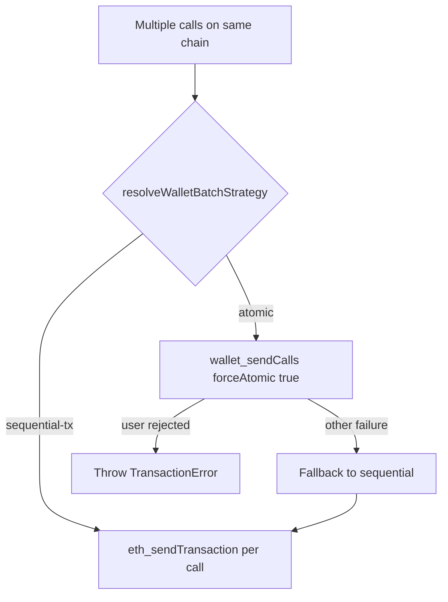
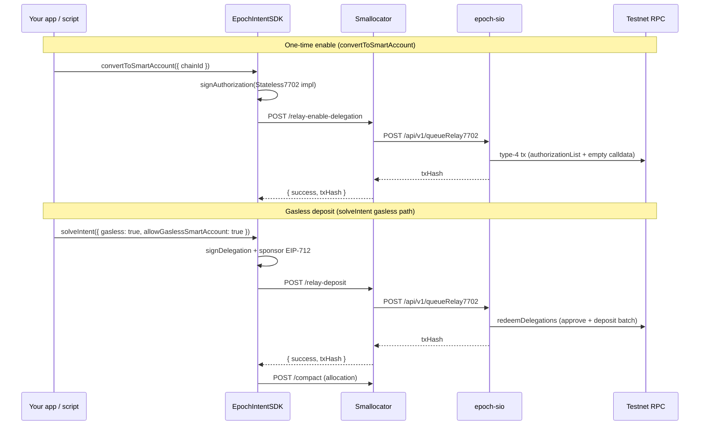

# Transaction Batching & EIP-7702

Epoch's SDK combines **EIP-5792 wallet batching** (`wallet_sendCalls`) and **EIP-7702 smart-account delegation** so users can approve, deposit, and execute multi-step intents with fewer wallet prompts — and, on testnet, without paying gas for Compact deposits when using a local signer.

**Scope:** testnet today for gasless relay. Batching applies wherever the user's wallet supports it (mainnet or testnet).

**Related guides:** [Gasless Deposits](gasless-deposits.md) (integrator checklist), [SDK Reference](sdk-reference.md) (method signatures).

***

## At a glance

| Path | Wallet type | On-chain gas | How calls run |
| ---- | ----------- | ------------ | ------------- |
| **Gasless relay** | Local private-key (`account.type === "local"`) | Relayer pays (testnet) | User signs EIP-7702 auth + delegation; **epoch-sio** broadcasts type-4 tx |
| **Wallet batch (atomic)** | Injected wallet with active smart account | User pays | Single `wallet_sendCalls` with `atomicRequired: true` |
| **Wallet batch (non-atomic)** | Injected wallet with batch support, plain EOA | User pays | Single `wallet_sendCalls` without atomic guarantee |
| **Sequential** | Plain EOA or local wallet | User pays | Separate `eth_sendTransaction` per call |

**User-facing rule:** when gasless mode is enabled for a flow, treat the **entire experience** as gasless — do not tell users only part of the intent is sponsored.

***

## Transaction batching (EIP-5792)

When an ERC-20 Compact deposit needs **approve + deposit**, or when `solveIntent` returns **multiple execution transactions on the same chain**, the SDK tries to batch them into one wallet prompt instead of two or more separate signatures.

### Where batching runs

1. **Compact deposit (`depositToCompact`)** — if allowance is insufficient, the SDK builds `[approve, depositAndRegister]` (or approve-reset + approve + deposit for USDT-style tokens) and batches when the wallet strategy allows it.
2. **Multi-transaction intents (`solveIntent`, `resourceLockRequired: false`)** — contiguous transactions on the same chain are grouped and sent via `executeWalletBatch` when batching is supported.

Local private-key wallets **never** use `wallet_sendCalls`; they always send sequential transactions (or use the gasless relay path when configured).

### Batch strategy resolution

The SDK probes the wallet with `wallet_getCapabilities` and reads the user's on-chain code for EIP-7702 delegation:

```typescript
import {
  resolveWalletBatchStrategy,
  canBatchCalls,
} from "@epoch-protocol/epoch-intents-sdk";

const strategy = await resolveWalletBatchStrategy({
  walletClient,
  chainId: 84532,
  user: account.address,
  publicClient,
});
// strategy.mode: "atomic" | "sequential-tx"
```

| Condition | `mode` | Behavior |
| --------- | ------ | -------- |
| Local private-key account | `sequential-tx` | Never calls `wallet_sendCalls` |
| Injected wallet, plain EOA, atomic status `ready` / `unsupported` | `sequential-tx` | SDK does **not** prompt smart-account upgrade |
| Injected wallet, EIP-7702 delegated (Epoch or other delegate) | `atomic` | `wallet_sendCalls` with `forceAtomic: true` |
| Injected wallet, atomic status `supported` or `enabled` | `atomic` | Smart wallet active — atomic batch |

`canBatchCalls` maps the strategy to `{ supported, atomic, mode }` for UI hints.

### Execution flow



Supported batch chain objects in the SDK: Base Sepolia (84532), Sepolia (11155111), Optimism Sepolia (11155420), Polygon Amoy (80002).

### Execution status callback

When batching multi-leg intent execution, `onExecutionStatus` reports `phase: "batching"` before `sending`. Per-leg receipts are mapped from the bundle via `mapBundleReceiptsToLegs`.

```typescript
await sdk.solveIntent({
  sponsorAddress,
  taskTypeString,
  intentData,
  quoteResult,
  onExecutionStatus: (s) => {
    if (s.phase === "batching") {
      console.log("Wallet batch in progress…");
    }
  },
});
```

### Low-level batch API

For custom integrations:

```typescript
import { executeWalletBatch } from "@epoch-protocol/epoch-intents-sdk";

const receipts = await executeWalletBatch({
  walletClient,
  chainId: 84532,
  account: userAddress,
  calls: [
    { to: tokenAddress, data: approveCalldata, value: 0n },
    { to: compactAddress, data: depositCalldata, value: 0n },
  ],
  forceAtomic: true, // smart-wallet path
});
```

***

## EIP-7702 gasless relay (testnet)

EIP-7702 lets an EOA temporarily delegate its code to a **Stateless7702** implementation (MetaMask Delegation Toolkit). After delegation, the account behaves like a smart wallet: the user signs **delegations** off-chain, and a **relayer** can redeem them on-chain without the user paying gas.

Epoch uses this for **Compact approve + deposit** on testnet when the integrator opts in with a **local signer**.

### Architecture



| Component | Role |
| --------- | ---- |
| **EpochIntentSDK** (`smallocator/sdk`) | Builds deposit calls, signs 7702 authorization, delegation, and Compact sponsor signature |
| **Smallocator** | Validates relay requests (`/relay-enable-delegation`, `/relay-deposit`), forwards to SIO |
| **epoch-sio** | Queues and broadcasts type-4 transactions via `executeRelay7702Transaction` using `RELAYER_PRIVATE_KEY` |

SIO endpoints (internal token required):

| Method | Path | Purpose |
| ------ | ---- | ------- |
| `POST` | `/api/v1/queueRelay7702` | Enqueue relay transaction |
| `GET` | `/api/v1/relay7702Status` | Poll queue status |

Smallocator endpoints (public to SDK):

| Method | Path | Purpose |
| ------ | ---- | ------- |
| `GET` | `/gasless-status` | `{ enabled, supportedChainIds, relayerAddress }` |
| `POST` | `/relay-enable-delegation` | One-time 7702 enable |
| `POST` | `/relay-deposit` | Sponsored approve + deposit |

### Supported testnet chains

| Network | Chain ID |
| ------- | -------- |
| Base Sepolia | 84532 |
| Ethereum Sepolia | 11155111 |
| Optimism Sepolia | 11155420 |
| Polygon Amoy | 80002 |

**Approved 7702 delegates** (either is accepted for existing EOAs):

- **Canonical:** MetaMask Stateless7702 `0x63c0c19a282a1B52b07dD5a65b58948A07DAE32B`
- **Legacy Epoch deploy:** `0x7702CCC6b7bba39a3095537330692B363e4D6e8f`

New enables target the MetaMask implementation.

### Local wallet vs browser wallet

| | Local private-key | Injected (MetaMask, …) |
| --- | --- | --- |
| Gasless relay | Yes — `allowGaslessSmartAccount: true` + prior `convertToSmartAccount` | No — user pays gas |
| Batching | Sequential txs only | `wallet_sendCalls` when already a smart wallet |
| Setup | `convertToSmartAccount({ chainId })` once per EOA + chain | SDK does **not** prompt upgrade; batch only if already delegated |

Probe before showing gasless UI:

```typescript
const status = await sdk.getWalletGaslessStatus(chainId);
// delegation: "none" | "epoch" | "other"
// canRelayEnable, canRelayDeposit, accountType, needsSetup
```

If `delegation === "other"`, the EOA is delegated to an unsupported implementation — use a fresh EOA or revoke before gasless relay.

### Gasless deposit request shape

The SDK POSTs to `/relay-deposit` with (simplified):

```typescript
{
  idempotencyKey: string,
  chainId: number,
  userAddress: address,
  authorization?: Signed7702Authorization,  // omitted if already delegated
  delegation: SignedDelegation,           // MetaMask DelegationManager caveat
  calls: [{ to, data, value }],
  executionData: hex,                       // redeemDelegations calldata
  sponsorSignature: hex,                    // EIP-712 "The Compact" v1
  witnessTypeString: string,
  compact: { arbiter, sponsor, nonce, expires, id, lockTag, token, amount, intentData? },
  claimHash: hex,
}
```

Single-call deposits use `exactExecution`; multi-call (approve + deposit) uses `exactExecutionBatch` — the SDK keeps delegation caveats and redeem mode in sync.

### Operator configuration

**Smallocator** (`.env`):

| Variable | Notes |
| -------- | ----- |
| `GASLESS_ENABLED=true` | Enables relay routes |
| `SIO_API_TOKEN` | Auth to epoch-sio internal API |

**epoch-sio** (`.env`):

| Variable | Notes |
| -------- | ----- |
| `RELAYER_PRIVATE_KEY` | **Required** — distinct EOA from executor; broadcasts 7702 txs |
| `RELAYER_MIN_BALANCE_WEI` | Optional floor (default `1000000000000000`) |

Verify live status:

```http
GET {apiBaseUrl}/gasless-status
```

***

## How batching and 7702 interact

These features solve different problems but share the "smart wallet active" signal:

- **7702 delegation on-chain** → `resolveWalletBatchStrategy` returns `atomic` for injected wallets → approve + deposit batch in **one wallet prompt** (user-paid gas).
- **7702 + local signer + gasless relay** → user signs delegation off-chain; **relayer** submits approve + deposit atomically on-chain (user does not pay gas).
- **Plain EOA** → sequential transactions; two prompts for approve + deposit.

The SDK **never** auto-converts browser wallets to smart accounts. Gasless relay with strict failure (no silent fallback) requires `allowGaslessSmartAccount: true` on local wallets only.

***

## End-to-end test script

Use the SDK smoke test to validate smallocator + epoch-sio + local signer wiring.

**Script:** `smallocator/sdk/test/local-wallet-gasless.ts`

### Prerequisites

- Smallocator: `GASLESS_ENABLED=true`, `SIO_API_TOKEN` set
- epoch-sio: funded `RELAYER_PRIVATE_KEY`
- Test EOA with testnet ETH and ERC-20 balance (for intent leg after deposit)

### Environment

Create `smallocator/sdk/.env.local` (do not commit keys):

```bash
GASLESS_API_BASE_URL=https://testnet-dev.epochprotocol.xyz
# Or local: http://localhost:3000

GASLESS_CHAIN_ID=84532
GASLESS_RPC_URL=https://sepolia.base.org
GASLESS_PRIVATE_KEY=0x...

# Swap intent — tokenIn and tokenOut must differ
INTENT_TOKEN_IN=0x2BB4FfD7E2c6D432b697554Efd77fA13bdbefd69
INTENT_TOKEN_OUT=0xc30f1Ce05d1434d484E9A47283aA925fc8A8699a
INTENT_AMOUNT_IN=1
INTENT_TOKEN_DECIMALS=18
INTENT_DEST_CHAIN_ID=84532
```

### Run

```bash
cd smallocator/sdk
pnpm build
pnpm example:local-wallet
```

Success output:

```text
=== PASS === Local wallet gasless flow complete.
```

| Env flag | Effect |
| -------- | ------ |
| `SKIP_SETUP=1` | Skip `convertToSmartAccount`; run intent only |
| `SKIP_INTENT=1` | Setup + verify only |

### What the script exercises

1. `GET /gasless-status` and `getWalletGaslessStatus`
2. `convertToSmartAccount` → SIO-relayed 7702 enable
3. `verifySmartAccountWorks`
4. `getIntentQuote` → `solveIntent({ gasless: true, allowGaslessSmartAccount: true })`
5. `getIntentStatus` polling

### Injected wallet — batch probe

**Script:** [`scripts/injected-wallet-batch-probe.ts`](../scripts/injected-wallet-batch-probe.ts)

Copy into a wagmi React app. Probes `resolveWalletBatchStrategy`, `canBatchCalls`, and confirms `canRelayDeposit === false` for injected wallets. Runs `solveIntent` without `allowGaslessSmartAccount` — user-paid gas with optional atomic batch.

See [Gasless Deposits — Injected wallets: batching](gasless-deposits.md#injected-wallets-batching-not-gasless) for edge cases.

Other examples:

```bash
pnpm test:batching      # unit tests for strategy + executeWalletBatch
pnpm test:gasless       # capability + signing helpers
pnpm example:gasless    # lighter walkthrough (integration-gasless-example.ts)
```

***

## SDK exports reference

### Batching

| Export | Purpose |
| ------ | ------- |
| `resolveWalletBatchStrategy` | Pick `atomic` vs `sequential-tx` |
| `canBatchCalls` | UI-friendly capability flags |
| `executeWalletBatch` | Low-level `wallet_sendCalls` wrapper |
| `groupContiguousByChain` | Group quote transactions by chain |
| `mapBundleReceiptsToLegs` | Map batch receipts to per-leg callbacks |
| `isUserWalletRejection` | Detect wallet deny / reject |

### EIP-7702 / gasless

| Export | Purpose |
| ------ | ------- |
| `getWalletGaslessStatus` | Delegation probe + relay eligibility |
| `convertToSmartAccount` | One-time enable via SIO relay |
| `gaslessDepositToCompact` | Standalone relayed deposit |
| `GaslessUnavailableError` | Strict gasless failure |
| `GASLESS_SUPPORTED_CHAIN_IDS` | Testnet chain list |
| `shouldUseGaslessRelay` | True for local signers only |
| `mockEip7702DelegatedCode` | Test helper for delegation bytecode |
| `signCompactSponsorWithPrivateKey` | Manual relay debugging |

### `solveIntent` parameters

| Param | Effect |
| ----- | ------ |
| `gasless: true` + `allowGaslessSmartAccount: true` | Local wallet: SIO relay; throws on failure |
| `gasless: true` (browser, no allow flag) | Wallet-paid; batch when smart wallet active |
| `gasless: false` | Standard wallet-paid deposit |

See [Gasless Deposits](gasless-deposits.md) for integrator checklist and error handling.

***

## Common failures

| Symptom | Likely cause |
| ------- | ------------ |
| Two separate wallet prompts on plain EOA | Expected — batching requires smart wallet or atomic capability |
| `GaslessUnavailableError` on local wallet | Chain disabled, EOA not delegated, or `delegation === "other"` |
| `RELAYER_UNFUNDED` | epoch-sio relayer balance below minimum |
| `GASLESS_DISABLED` | `GASLESS_ENABLED` not true on smallocator |
| Batch fails then sequential succeeds | Wallet rejected atomic batch or RPC issue — check logs for fallback |
| `INVALID_AUTHORIZATION` | Wrong delegate impl or chainId mismatch |

***

## Next steps

* [Gasless Deposits](gasless-deposits.md) — step-by-step integrator guide
* [SDK Integration Guide](sdk-integration-guide.md) — full checklist
* [SDK Reference](sdk-reference.md) — all method signatures
* [Error Handling](error-handling.md) — `GaslessUnavailableError` and retries
